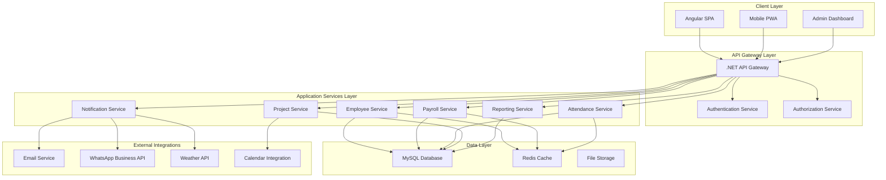
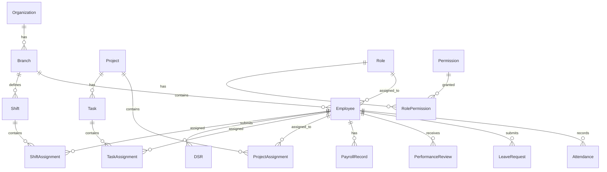

# strideHR System Design Document

## Overview

strideHR is an enterprise-grade, full-stack Human Resource Management System designed to meet international standards for global organizations. The system provides comprehensive HR functionality across multiple countries and branches while maintaining compliance with local regulations and cultural practices.

### Technology Stack
- **Frontend**: Angular 17+ with Bootstrap 5
- **Backend**: .NET 8 Web API with Entity Framework Core
- **Database**: MySQL 8.0+
- **Authentication**: JWT with role-based access control
- **Real-time Communication**: SignalR
- **File Storage**: Local file system with cloud storage options
- **Caching**: Redis for session management and performance
- **API Documentation**: Swagger/OpenAPI

### Key Design Principles
- **Microservices-Ready Architecture**: Modular design for future scalability
- **Multi-tenancy Support**: Branch-based data isolation
- **Mobile-First Responsive Design**: Bootstrap 5 with PWA capabilities
- **Security-First Approach**: Comprehensive audit trails and data protection
- **Internationalization**: Multi-currency, multi-timezone, multi-language support
- **Performance Optimization**: Lazy loading, caching, and efficient data queries

## Architecture

### High-Level System Architecture



### Database Architecture

The system uses a comprehensive relational database design with the following core entities:

#### Core Entity Relationships



## Components and Interfaces

### Frontend Components (Angular)

#### 1. Core Layout Components
```typescript
// app-layout.component.ts
@Component({
  selector: 'app-layout',
  template: `
    <app-header></app-header>
    <app-sidebar></app-sidebar>
    <main class="main-content">
      <router-outlet></router-outlet>
    </main>
    <app-footer></app-footer>
  `
})
export class AppLayoutComponent {
  // Layout management logic
}
```

#### 2. Dashboard Components
```typescript
// dashboard.component.ts
@Component({
  selector: 'app-dashboard',
  template: `
    <div class="dashboard-container">
      <app-weather-time-widget></app-weather-time-widget>
      <app-attendance-widget></app-attendance-widget>
      <app-birthday-widget></app-birthday-widget>
      <app-project-status-widget></app-project-status-widget>
      <app-quick-actions></app-quick-actions>
    </div>
  `
})
export class DashboardComponent implements OnInit {
  userRole: string;
  dashboardWidgets: Widget[];
  
  ngOnInit() {
    this.loadRoleBasedWidgets();
  }
}
```

#### 3. Employee Management Components
```typescript
// employee-list.component.ts
@Component({
  selector: 'app-employee-list',
  template: `
    <div class="employee-management">
      <app-search-filter></app-search-filter>
      <app-employee-grid [employees]="employees"></app-employee-grid>
      <app-pagination></app-pagination>
    </div>
  `
})
export class EmployeeListComponent {
  employees: Employee[];
  searchCriteria: SearchCriteria;
  
  onSearch(criteria: SearchCriteria) {
    this.employeeService.searchEmployees(criteria);
  }
}
```

#### 4. Attendance Management Components
```typescript
// attendance-tracker.component.ts
@Component({
  selector: 'app-attendance-tracker',
  template: `
    <div class="attendance-tracker">
      <div class="check-in-section">
        <button class="btn btn-success rounded-pill" 
                (click)="checkIn()" 
                [disabled]="isCheckedIn">
          <i class="fas fa-sign-in-alt"></i> Check In
        </button>
        <button class="btn btn-warning rounded-pill" 
                (click)="takeBreak()" 
                [disabled]="!isCheckedIn">
          <i class="fas fa-coffee"></i> Take Break
        </button>
        <button class="btn btn-danger rounded-pill" 
                (click)="checkOut()" 
                [disabled]="!isCheckedIn">
          <i class="fas fa-sign-out-alt"></i> Check Out
        </button>
      </div>
      <app-attendance-status></app-attendance-status>
    </div>
  `
})
export class AttendanceTrackerComponent {
  isCheckedIn: boolean = false;
  currentStatus: AttendanceStatus;
  
  checkIn() {
    this.attendanceService.checkIn().subscribe(response => {
      this.showSuccessMessage(`Check-in successful! Welcome back, ${this.currentUser.name}`);
    });
  }
}
```

#### 5. Project Management Components
```typescript
// kanban-board.component.ts
@Component({
  selector: 'app-kanban-board',
  template: `
    <div class="kanban-container">
      <div class="view-toggle">
        <button class="btn btn-outline-primary" 
                [class.active]="viewMode === 'kanban'"
                (click)="setViewMode('kanban')">
          <i class="fas fa-columns"></i> Kanban
        </button>
        <button class="btn btn-outline-primary" 
                [class.active]="viewMode === 'list'"
                (click)="setViewMode('list')">
          <i class="fas fa-list"></i> List
        </button>
      </div>
      
      <div *ngIf="viewMode === 'kanban'" class="kanban-board">
        <div class="kanban-column" *ngFor="let column of columns">
          <h3>{{ column.title }}</h3>
          <div cdkDropList 
               [cdkDropListData]="column.tasks"
               (cdkDropListDropped)="drop($event)">
            <div class="task-card" 
                 *ngFor="let task of column.tasks" 
                 cdkDrag>
              <app-task-card [task]="task"></app-task-card>
            </div>
          </div>
        </div>
      </div>
      
      <div *ngIf="viewMode === 'list'" class="list-view">
        <app-task-list [tasks]="allTasks"></app-task-list>
      </div>
    </div>
  `
})
export class KanbanBoardComponent {
  viewMode: 'kanban' | 'list' = 'kanban';
  columns: KanbanColumn[];
  allTasks: Task[];
}
```

### Backend Services (.NET)

#### 1. Employee Service
```csharp
// IEmployeeService.cs
public interface IEmployeeService
{
    Task<Employee> CreateEmployeeAsync(CreateEmployeeDto dto);
    Task<Employee> GetEmployeeByIdAsync(int id);
    Task<PagedResult<Employee>> GetEmployeesAsync(EmployeeSearchCriteria criteria);
    Task<Employee> UpdateEmployeeAsync(int id, UpdateEmployeeDto dto);
    Task<bool> DeactivateEmployeeAsync(int id);
    Task<List<Employee>> GetEmployeesByBranchAsync(int branchId);
}

// EmployeeService.cs
[Service]
public class EmployeeService : IEmployeeService
{
    private readonly IEmployeeRepository _repository;
    private readonly IMapper _mapper;
    private readonly ILogger<EmployeeService> _logger;
    
    public async Task<Employee> CreateEmployeeAsync(CreateEmployeeDto dto)
    {
        var employee = _mapper.Map<Employee>(dto);
        employee.EmployeeId = await GenerateEmployeeIdAsync(dto.BranchId);
        employee.CreatedAt = DateTime.UtcNow;
        
        await _repository.AddAsync(employee);
        await _repository.SaveChangesAsync();
        
        _logger.LogInformation("Employee created: {EmployeeId}", employee.EmployeeId);
        return employee;
    }
}
```

#### 2. Attendance Service
```csharp
// IAttendanceService.cs
public interface IAttendanceService
{
    Task<AttendanceRecord> CheckInAsync(int employeeId, CheckInDto dto);
    Task<AttendanceRecord> CheckOutAsync(int employeeId);
    Task<AttendanceRecord> StartBreakAsync(int employeeId, BreakType breakType);
    Task<AttendanceRecord> EndBreakAsync(int employeeId);
    Task<List<AttendanceRecord>> GetTodayAttendanceAsync(int branchId);
    Task<AttendanceReport> GenerateAttendanceReportAsync(AttendanceReportCriteria criteria);
}

// AttendanceService.cs
[Service]
public class AttendanceService : IAttendanceService
{
    private readonly IAttendanceRepository _repository;
    private readonly INotificationService _notificationService;
    
    public async Task<AttendanceRecord> CheckInAsync(int employeeId, CheckInDto dto)
    {
        var existingRecord = await _repository.GetTodayRecordAsync(employeeId);
        if (existingRecord?.CheckInTime != null)
            throw new BusinessException("Employee already checked in today");
            
        var record = new AttendanceRecord
        {
            EmployeeId = employeeId,
            Date = DateTime.Today,
            CheckInTime = DateTime.Now,
            Location = dto.Location,
            Status = AttendanceStatus.Present
        };
        
        await _repository.AddAsync(record);
        await _repository.SaveChangesAsync();
        
        // Send real-time notification
        await _notificationService.NotifyAttendanceUpdateAsync(employeeId, "checked_in");
        
        return record;
    }
}
```

#### 3. Payroll Service
```csharp
// IPayrollService.cs
public interface IPayrollService
{
    Task<PayrollRecord> CalculatePayrollAsync(int employeeId, PayrollPeriod period);
    Task<List<PayrollRecord>> ProcessBranchPayrollAsync(int branchId, PayrollPeriod period);
    Task<PayslipDto> GeneratePayslipAsync(int payrollRecordId);
    Task<bool> ApprovePayrollAsync(int payrollRecordId, int approverId);
    Task<PayrollFormula> CreateFormulaAsync(CreateFormulaDto dto);
}

// PayrollService.cs
[Service]
public class PayrollService : IPayrollService
{
    private readonly IPayrollRepository _repository;
    private readonly IFormulaEngine _formulaEngine;
    private readonly ICurrencyService _currencyService;
    
    public async Task<PayrollRecord> CalculatePayrollAsync(int employeeId, PayrollPeriod period)
    {
        var employee = await _repository.GetEmployeeWithDetailsAsync(employeeId);
        var attendanceData = await _repository.GetAttendanceDataAsync(employeeId, period);
        var leaveData = await _repository.GetLeaveDataAsync(employeeId, period);
        
        var calculation = new PayrollCalculation
        {
            BasicSalary = employee.BasicSalary,
            WorkingDays = attendanceData.WorkingDays,
            OvertimeHours = attendanceData.OvertimeHours,
            LeaveDeductions = leaveData.UnpaidLeaveDays
        };
        
        // Apply custom formulas
        var grossSalary = await _formulaEngine.CalculateGrossSalaryAsync(calculation);
        var deductions = await _formulaEngine.CalculateDeductionsAsync(calculation);
        var netSalary = grossSalary - deductions;
        
        // Apply currency conversion if needed
        var localCurrency = await _currencyService.GetBranchCurrencyAsync(employee.BranchId);
        
        var payrollRecord = new PayrollRecord
        {
            EmployeeId = employeeId,
            Period = period,
            GrossSalary = grossSalary,
            Deductions = deductions,
            NetSalary = netSalary,
            Currency = localCurrency,
            Status = PayrollStatus.Calculated
        };
        
        await _repository.AddAsync(payrollRecord);
        await _repository.SaveChangesAsync();
        
        return payrollRecord;
    }
}
```

#### 4. Project Management Service
```csharp
// IProjectService.cs
public interface IProjectService
{
    Task<Project> CreateProjectAsync(CreateProjectDto dto);
    Task<Project> AssignTeamMembersAsync(int projectId, List<int> employeeIds);
    Task<Task> CreateTaskAsync(CreateTaskDto dto);
    Task<ProjectProgress> GetProjectProgressAsync(int projectId);
    Task<List<ProjectHoursReport>> GetHoursTrackingAsync(int teamLeaderId);
}

// ProjectService.cs
[Service]
public class ProjectService : IProjectService
{
    private readonly IProjectRepository _repository;
    private readonly IDSRService _dsrService;
    
    public async Task<ProjectProgress> GetProjectProgressAsync(int projectId)
    {
        var project = await _repository.GetProjectWithTasksAsync(projectId);
        var dsrHours = await _dsrService.GetProjectHoursAsync(projectId);
        
        var progress = new ProjectProgress
        {
            ProjectId = projectId,
            TotalEstimatedHours = project.EstimatedHours,
            ActualHoursWorked = dsrHours.Sum(h => h.HoursWorked),
            CompletionPercentage = CalculateCompletionPercentage(project),
            IsOnTrack = dsrHours.Sum(h => h.HoursWorked) <= project.EstimatedHours,
            RemainingHours = Math.Max(0, project.EstimatedHours - dsrHours.Sum(h => h.HoursWorked))
        };
        
        return progress;
    }
}
```

## Data Models

### Core Entity Models

#### 1. Organization and Branch Models
```csharp
// Organization.cs
public class Organization
{
    public int Id { get; set; }
    public string Name { get; set; }
    public string Address { get; set; }
    public string Email { get; set; }
    public string Phone { get; set; }
    public string Logo { get; set; }
    public TimeSpan NormalWorkingHours { get; set; }
    public decimal OvertimeRate { get; set; }
    public int ProductiveHoursThreshold { get; set; }
    public bool BranchIsolationEnabled { get; set; }
    public DateTime CreatedAt { get; set; }
    
    // Navigation Properties
    public virtual ICollection<Branch> Branches { get; set; }
    public virtual ICollection<Shift> Shifts { get; set; }
}

// Branch.cs
public class Branch
{
    public int Id { get; set; }
    public int OrganizationId { get; set; }
    public string Name { get; set; }
    public string Country { get; set; }
    public string Currency { get; set; }
    public string TimeZone { get; set; }
    public string Address { get; set; }
    public List<string> LocalHolidays { get; set; }
    public Dictionary<string, object> ComplianceSettings { get; set; }
    
    // Navigation Properties
    public virtual Organization Organization { get; set; }
    public virtual ICollection<Employee> Employees { get; set; }
}
```

#### 2. Employee Models
```csharp
// Employee.cs
public class Employee
{
    public int Id { get; set; }
    public string EmployeeId { get; set; }
    public int BranchId { get; set; }
    public string FirstName { get; set; }
    public string LastName { get; set; }
    public string Email { get; set; }
    public string Phone { get; set; }
    public string ProfilePhoto { get; set; }
    public DateTime DateOfBirth { get; set; }
    public DateTime JoiningDate { get; set; }
    public string Designation { get; set; }
    public string Department { get; set; }
    public decimal BasicSalary { get; set; }
    public EmployeeStatus Status { get; set; }
    public int? ReportingManagerId { get; set; }
    public DateTime CreatedAt { get; set; }
    public DateTime? UpdatedAt { get; set; }
    
    // Navigation Properties
    public virtual Branch Branch { get; set; }
    public virtual Employee ReportingManager { get; set; }
    public virtual ICollection<Employee> Subordinates { get; set; }
    public virtual ICollection<AttendanceRecord> AttendanceRecords { get; set; }
    public virtual ICollection<LeaveRequest> LeaveRequests { get; set; }
    public virtual ICollection<PayrollRecord> PayrollRecords { get; set; }
    public virtual ICollection<ProjectAssignment> ProjectAssignments { get; set; }
    public virtual ICollection<DSR> DSRs { get; set; }
    public virtual ICollection<EmployeeRole> EmployeeRoles { get; set; }
}

// Role.cs
public class Role
{
    public int Id { get; set; }
    public string Name { get; set; }
    public string Description { get; set; }
    public int HierarchyLevel { get; set; }
    public bool IsActive { get; set; }
    public DateTime CreatedAt { get; set; }
    
    // Navigation Properties
    public virtual ICollection<RolePermission> RolePermissions { get; set; }
    public virtual ICollection<EmployeeRole> EmployeeRoles { get; set; }
}

// Permission.cs
public class Permission
{
    public int Id { get; set; }
    public string Name { get; set; }
    public string Module { get; set; }
    public string Action { get; set; }
    public string Resource { get; set; }
    
    // Navigation Properties
    public virtual ICollection<RolePermission> RolePermissions { get; set; }
}
```

#### 3. Attendance Models
```csharp
// AttendanceRecord.cs
public class AttendanceRecord
{
    public int Id { get; set; }
    public int EmployeeId { get; set; }
    public DateTime Date { get; set; }
    public DateTime? CheckInTime { get; set; }
    public DateTime? CheckOutTime { get; set; }
    public TimeSpan? TotalWorkingHours { get; set; }
    public TimeSpan? BreakDuration { get; set; }
    public TimeSpan? OvertimeHours { get; set; }
    public AttendanceStatus Status { get; set; }
    public string Location { get; set; }
    public string Notes { get; set; }
    
    // Navigation Properties
    public virtual Employee Employee { get; set; }
    public virtual ICollection<BreakRecord> BreakRecords { get; set; }
}

// BreakRecord.cs
public class BreakRecord
{
    public int Id { get; set; }
    public int AttendanceRecordId { get; set; }
    public BreakType Type { get; set; }
    public DateTime StartTime { get; set; }
    public DateTime? EndTime { get; set; }
    public TimeSpan? Duration { get; set; }
    
    // Navigation Properties
    public virtual AttendanceRecord AttendanceRecord { get; set; }
}

// Enums
public enum AttendanceStatus
{
    Present,
    Absent,
    Late,
    OnBreak,
    HalfDay,
    OnLeave
}

public enum BreakType
{
    Tea,
    Lunch,
    Personal,
    Meeting
}
```

#### 4. Project and Task Models
```csharp
// Project.cs
public class Project
{
    public int Id { get; set; }
    public string Name { get; set; }
    public string Description { get; set; }
    public DateTime StartDate { get; set; }
    public DateTime EndDate { get; set; }
    public int EstimatedHours { get; set; }
    public decimal Budget { get; set; }
    public ProjectStatus Status { get; set; }
    public ProjectPriority Priority { get; set; }
    public int CreatedBy { get; set; }
    public DateTime CreatedAt { get; set; }
    
    // Navigation Properties
    public virtual Employee CreatedByEmployee { get; set; }
    public virtual ICollection<ProjectAssignment> ProjectAssignments { get; set; }
    public virtual ICollection<Task> Tasks { get; set; }
}

// Task.cs
public class Task
{
    public int Id { get; set; }
    public int ProjectId { get; set; }
    public string Title { get; set; }
    public string Description { get; set; }
    public int EstimatedHours { get; set; }
    public TaskStatus Status { get; set; }
    public TaskPriority Priority { get; set; }
    public DateTime? DueDate { get; set; }
    public DateTime CreatedAt { get; set; }
    
    // Navigation Properties
    public virtual Project Project { get; set; }
    public virtual ICollection<TaskAssignment> TaskAssignments { get; set; }
}

// DSR.cs (Daily Status Report)
public class DSR
{
    public int Id { get; set; }
    public int EmployeeId { get; set; }
    public DateTime Date { get; set; }
    public int? ProjectId { get; set; }
    public int? TaskId { get; set; }
    public decimal HoursWorked { get; set; }
    public string Description { get; set; }
    public DSRStatus Status { get; set; }
    public DateTime SubmittedAt { get; set; }
    
    // Navigation Properties
    public virtual Employee Employee { get; set; }
    public virtual Project Project { get; set; }
    public virtual Task Task { get; set; }
}
```

## Error Handling

### Global Exception Handling
```csharp
// GlobalExceptionMiddleware.cs
public class GlobalExceptionMiddleware
{
    private readonly RequestDelegate _next;
    private readonly ILogger<GlobalExceptionMiddleware> _logger;
    
    public async Task InvokeAsync(HttpContext context)
    {
        try
        {
            await _next(context);
        }
        catch (Exception ex)
        {
            _logger.LogError(ex, "An unhandled exception occurred");
            await HandleExceptionAsync(context, ex);
        }
    }
    
    private async Task HandleExceptionAsync(HttpContext context, Exception exception)
    {
        var response = new ApiResponse<object>
        {
            Success = false,
            Message = GetErrorMessage(exception),
            Errors = GetErrorDetails(exception)
        };
        
        context.Response.ContentType = "application/json";
        context.Response.StatusCode = GetStatusCode(exception);
        
        await context.Response.WriteAsync(JsonSerializer.Serialize(response));
    }
}

// Custom Exceptions
public class BusinessException : Exception
{
    public BusinessException(string message) : base(message) { }
}

public class ValidationException : Exception
{
    public Dictionary<string, string[]> Errors { get; }
    
    public ValidationException(Dictionary<string, string[]> errors) : base("Validation failed")
    {
        Errors = errors;
    }
}
```

### Frontend Error Handling
```typescript
// error-handler.service.ts
@Injectable({
  providedIn: 'root'
})
export class ErrorHandlerService {
  
  handleError(error: any): Observable<never> {
    let errorMessage = 'An unexpected error occurred';
    
    if (error.error instanceof ErrorEvent) {
      // Client-side error
      errorMessage = error.error.message;
    } else {
      // Server-side error
      errorMessage = error.error?.message || `Error Code: ${error.status}`;
    }
    
    this.notificationService.showError(errorMessage);
    console.error('Error occurred:', error);
    
    return throwError(() => new Error(errorMessage));
  }
}

// HTTP Interceptor
@Injectable()
export class ErrorInterceptor implements HttpInterceptor {
  
  intercept(request: HttpRequest<any>, next: HttpHandler): Observable<HttpEvent<any>> {
    return next.handle(request).pipe(
      catchError((error: HttpErrorResponse) => {
        if (error.status === 401) {
          this.authService.logout();
          this.router.navigate(['/login']);
        }
        
        return this.errorHandler.handleError(error);
      })
    );
  }
}
```

## Testing Strategy

### Backend Testing
```csharp
// EmployeeServiceTests.cs
[TestClass]
public class EmployeeServiceTests
{
    private Mock<IEmployeeRepository> _mockRepository;
    private Mock<IMapper> _mockMapper;
    private Mock<ILogger<EmployeeService>> _mockLogger;
    private EmployeeService _service;
    
    [TestInitialize]
    public void Setup()
    {
        _mockRepository = new Mock<IEmployeeRepository>();
        _mockMapper = new Mock<IMapper>();
        _mockLogger = new Mock<ILogger<EmployeeService>>();
        _service = new EmployeeService(_mockRepository.Object, _mockMapper.Object, _mockLogger.Object);
    }
    
    [TestMethod]
    public async Task CreateEmployeeAsync_ValidData_ReturnsEmployee()
    {
        // Arrange
        var dto = new CreateEmployeeDto
        {
            FirstName = "John",
            LastName = "Doe",
            Email = "john.doe@example.com",
            BranchId = 1
        };
        
        var employee = new Employee { Id = 1, FirstName = "John", LastName = "Doe" };
        _mockMapper.Setup(m => m.Map<Employee>(dto)).Returns(employee);
        _mockRepository.Setup(r => r.AddAsync(It.IsAny<Employee>())).Returns(Task.CompletedTask);
        _mockRepository.Setup(r => r.SaveChangesAsync()).Returns(Task.CompletedTask);
        
        // Act
        var result = await _service.CreateEmployeeAsync(dto);
        
        // Assert
        Assert.IsNotNull(result);
        Assert.AreEqual("John", result.FirstName);
        _mockRepository.Verify(r => r.AddAsync(It.IsAny<Employee>()), Times.Once);
    }
}
```

### Frontend Testing
```typescript
// employee-list.component.spec.ts
describe('EmployeeListComponent', () => {
  let component: EmployeeListComponent;
  let fixture: ComponentFixture<EmployeeListComponent>;
  let mockEmployeeService: jasmine.SpyObj<EmployeeService>;

  beforeEach(async () => {
    const spy = jasmine.createSpyObj('EmployeeService', ['getEmployees', 'searchEmployees']);

    await TestBed.configureTestingModule({
      declarations: [EmployeeListComponent],
      providers: [
        { provide: EmployeeService, useValue: spy }
      ]
    }).compileComponents();

    fixture = TestBed.createComponent(EmployeeListComponent);
    component = fixture.componentInstance;
    mockEmployeeService = TestBed.inject(EmployeeService) as jasmine.SpyObj<EmployeeService>;
  });

  it('should create', () => {
    expect(component).toBeTruthy();
  });

  it('should load employees on init', () => {
    const mockEmployees = [
      { id: 1, firstName: 'John', lastName: 'Doe' },
      { id: 2, firstName: 'Jane', lastName: 'Smith' }
    ];
    
    mockEmployeeService.getEmployees.and.returnValue(of(mockEmployees));
    
    component.ngOnInit();
    
    expect(mockEmployeeService.getEmployees).toHaveBeenCalled();
    expect(component.employees).toEqual(mockEmployees);
  });
});
```

### Integration Testing
```csharp
// AttendanceIntegrationTests.cs
[TestClass]
public class AttendanceIntegrationTests : IntegrationTestBase
{
    [TestMethod]
    public async Task CheckIn_ValidEmployee_ReturnsSuccess()
    {
        // Arrange
        var employee = await CreateTestEmployeeAsync();
        var checkInDto = new CheckInDto
        {
            Location = "Office",
            Timestamp = DateTime.Now
        };
        
        // Act
        var response = await Client.PostAsJsonAsync($"/api/attendance/{employee.Id}/checkin", checkInDto);
        
        // Assert
        response.EnsureSuccessStatusCode();
        var result = await response.Content.ReadFromJsonAsync<AttendanceRecord>();
        Assert.IsNotNull(result);
        Assert.AreEqual(employee.Id, result.EmployeeId);
        Assert.IsNotNull(result.CheckInTime);
    }
}
```

This comprehensive design document provides the foundation for building strideHR as a world-class HRMS system. The architecture is scalable, maintainable, and follows industry best practices while meeting all your specified requirements.#
# Security Architecture

### Authentication and Authorization

#### JWT Token Implementation
```csharp
// JwtService.cs
public class JwtService : IJwtService
{
    private readonly JwtSettings _jwtSettings;
    private readonly IUserService _userService;
    
    public async Task<AuthenticationResult> AuthenticateAsync(LoginRequest request)
    {
        var user = await _userService.ValidateCredentialsAsync(request.Email, request.Password);
        if (user == null)
            throw new UnauthorizedException("Invalid credentials");
            
        var token = GenerateJwtToken(user);
        var refreshToken = GenerateRefreshToken();
        
        await _userService.SaveRefreshTokenAsync(user.Id, refreshToken);
        
        return new AuthenticationResult
        {
            Token = token,
            RefreshToken = refreshToken,
            User = user,
            ExpiresAt = DateTime.UtcNow.AddHours(_jwtSettings.ExpirationHours)
        };
    }
    
    private string GenerateJwtToken(User user)
    {
        var claims = new List<Claim>
        {
            new(ClaimTypes.NameIdentifier, user.Id.ToString()),
            new(ClaimTypes.Email, user.Email),
            new(ClaimTypes.Name, $"{user.FirstName} {user.LastName}"),
            new("BranchId", user.BranchId.ToString()),
            new("EmployeeId", user.EmployeeId)
        };
        
        // Add role-based claims
        foreach (var role in user.Roles)
        {
            claims.Add(new Claim(ClaimTypes.Role, role.Name));
            
            foreach (var permission in role.Permissions)
            {
                claims.Add(new Claim("permission", $"{permission.Module}:{permission.Action}"));
            }
        }
        
        var key = new SymmetricSecurityKey(Encoding.UTF8.GetBytes(_jwtSettings.SecretKey));
        var credentials = new SigningCredentials(key, SecurityAlgorithms.HmacSha256);
        
        var token = new JwtSecurityToken(
            issuer: _jwtSettings.Issuer,
            audience: _jwtSettings.Audience,
            claims: claims,
            expires: DateTime.UtcNow.AddHours(_jwtSettings.ExpirationHours),
            signingCredentials: credentials
        );
        
        return new JwtSecurityTokenHandler().WriteToken(token);
    }
}
```

#### Role-Based Access Control
```csharp
// PermissionAuthorizationHandler.cs
public class PermissionAuthorizationHandler : AuthorizationHandler<PermissionRequirement>
{
    protected override Task HandleRequirementAsync(
        AuthorizationHandlerContext context,
        PermissionRequirement requirement)
    {
        var permissions = context.User.Claims
            .Where(c => c.Type == "permission")
            .Select(c => c.Value)
            .ToList();
            
        if (permissions.Contains(requirement.Permission))
        {
            context.Succeed(requirement);
        }
        
        return Task.CompletedTask;
    }
}

// Usage in Controllers
[Authorize(Policy = "EmployeeManagement:Create")]
[HttpPost]
public async Task<IActionResult> CreateEmployee([FromBody] CreateEmployeeDto dto)
{
    var result = await _employeeService.CreateEmployeeAsync(dto);
    return Ok(result);
}
```

### Data Protection and Encryption

#### Sensitive Data Encryption
```csharp
// EncryptionService.cs
public class EncryptionService : IEncryptionService
{
    private readonly string _encryptionKey;
    
    public string Encrypt(string plainText)
    {
        if (string.IsNullOrEmpty(plainText))
            return plainText;
            
        using var aes = Aes.Create();
        aes.Key = Convert.FromBase64String(_encryptionKey);
        aes.GenerateIV();
        
        using var encryptor = aes.CreateEncryptor();
        using var msEncrypt = new MemoryStream();
        using var csEncrypt = new CryptoStream(msEncrypt, encryptor, CryptoStreamMode.Write);
        using var swEncrypt = new StreamWriter(csEncrypt);
        
        swEncrypt.Write(plainText);
        
        var iv = aes.IV;
        var encrypted = msEncrypt.ToArray();
        var result = new byte[iv.Length + encrypted.Length];
        
        Buffer.BlockCopy(iv, 0, result, 0, iv.Length);
        Buffer.BlockCopy(encrypted, 0, result, iv.Length, encrypted.Length);
        
        return Convert.ToBase64String(result);
    }
    
    public string Decrypt(string cipherText)
    {
        if (string.IsNullOrEmpty(cipherText))
            return cipherText;
            
        var fullCipher = Convert.FromBase64String(cipherText);
        
        using var aes = Aes.Create();
        aes.Key = Convert.FromBase64String(_encryptionKey);
        
        var iv = new byte[aes.BlockSize / 8];
        var cipher = new byte[fullCipher.Length - iv.Length];
        
        Buffer.BlockCopy(fullCipher, 0, iv, 0, iv.Length);
        Buffer.BlockCopy(fullCipher, iv.Length, cipher, 0, cipher.Length);
        
        aes.IV = iv;
        
        using var decryptor = aes.CreateDecryptor();
        using var msDecrypt = new MemoryStream(cipher);
        using var csDecrypt = new CryptoStream(msDecrypt, decryptor, CryptoStreamMode.Read);
        using var srDecrypt = new StreamReader(csDecrypt);
        
        return srDecrypt.ReadToEnd();
    }
}
```

### Audit Trail Implementation

#### Audit Logging
```csharp
// AuditLog.cs
public class AuditLog
{
    public int Id { get; set; }
    public string UserId { get; set; }
    public string UserName { get; set; }
    public string Action { get; set; }
    public string EntityName { get; set; }
    public string EntityId { get; set; }
    public string OldValues { get; set; }
    public string NewValues { get; set; }
    public string IpAddress { get; set; }
    public string UserAgent { get; set; }
    public DateTime Timestamp { get; set; }
}

// AuditInterceptor.cs
public class AuditInterceptor : IInterceptor
{
    private readonly IAuditService _auditService;
    private readonly IHttpContextAccessor _httpContextAccessor;
    
    public void Intercept(IInvocation invocation)
    {
        var method = invocation.Method;
        var auditAttribute = method.GetCustomAttribute<AuditableAttribute>();
        
        if (auditAttribute != null)
        {
            var oldValues = GetOldValues(invocation);
            
            invocation.Proceed();
            
            var newValues = GetNewValues(invocation);
            
            _ = Task.Run(async () =>
            {
                await _auditService.LogAsync(new AuditLog
                {
                    UserId = GetCurrentUserId(),
                    UserName = GetCurrentUserName(),
                    Action = auditAttribute.Action,
                    EntityName = auditAttribute.EntityName,
                    EntityId = GetEntityId(invocation),
                    OldValues = JsonSerializer.Serialize(oldValues),
                    NewValues = JsonSerializer.Serialize(newValues),
                    IpAddress = GetClientIpAddress(),
                    UserAgent = GetUserAgent(),
                    Timestamp = DateTime.UtcNow
                });
            });
        }
        else
        {
            invocation.Proceed();
        }
    }
}
```

## Performance Optimization

### Caching Strategy

#### Redis Implementation
```csharp
// CacheService.cs
public class CacheService : ICacheService
{
    private readonly IDatabase _database;
    private readonly ILogger<CacheService> _logger;
    
    public async Task<T> GetAsync<T>(string key)
    {
        try
        {
            var value = await _database.StringGetAsync(key);
            if (value.HasValue)
            {
                return JsonSerializer.Deserialize<T>(value);
            }
        }
        catch (Exception ex)
        {
            _logger.LogError(ex, "Error retrieving cache key: {Key}", key);
        }
        
        return default(T);
    }
    
    public async Task SetAsync<T>(string key, T value, TimeSpan? expiration = null)
    {
        try
        {
            var serializedValue = JsonSerializer.Serialize(value);
            await _database.StringSetAsync(key, serializedValue, expiration);
        }
        catch (Exception ex)
        {
            _logger.LogError(ex, "Error setting cache key: {Key}", key);
        }
    }
    
    public async Task RemoveAsync(string key)
    {
        try
        {
            await _database.KeyDeleteAsync(key);
        }
        catch (Exception ex)
        {
            _logger.LogError(ex, "Error removing cache key: {Key}", key);
        }
    }
}

// Usage in Services
public async Task<Employee> GetEmployeeByIdAsync(int id)
{
    var cacheKey = $"employee:{id}";
    var cachedEmployee = await _cacheService.GetAsync<Employee>(cacheKey);
    
    if (cachedEmployee != null)
        return cachedEmployee;
        
    var employee = await _repository.GetByIdAsync(id);
    if (employee != null)
    {
        await _cacheService.SetAsync(cacheKey, employee, TimeSpan.FromMinutes(30));
    }
    
    return employee;
}
```

### Database Optimization

#### Entity Framework Configuration
```csharp
// StrideHRDbContext.cs
public class StrideHRDbContext : DbContext
{
    protected override void OnModelCreating(ModelBuilder modelBuilder)
    {
        // Indexes for performance
        modelBuilder.Entity<Employee>()
            .HasIndex(e => e.EmployeeId)
            .IsUnique();
            
        modelBuilder.Entity<Employee>()
            .HasIndex(e => new { e.BranchId, e.Status });
            
        modelBuilder.Entity<AttendanceRecord>()
            .HasIndex(a => new { a.EmployeeId, a.Date });
            
        modelBuilder.Entity<PayrollRecord>()
            .HasIndex(p => new { p.EmployeeId, p.Period });
            
        // Soft delete global filter
        modelBuilder.Entity<Employee>()
            .HasQueryFilter(e => e.Status != EmployeeStatus.Deleted);
            
        // Value conversions for encryption
        modelBuilder.Entity<Employee>()
            .Property(e => e.BankAccountNumber)
            .HasConversion(
                v => _encryptionService.Encrypt(v),
                v => _encryptionService.Decrypt(v));
                
        // JSON column configuration
        modelBuilder.Entity<Branch>()
            .Property(b => b.ComplianceSettings)
            .HasConversion(
                v => JsonSerializer.Serialize(v),
                v => JsonSerializer.Deserialize<Dictionary<string, object>>(v));
    }
}
```

### Frontend Performance

#### Lazy Loading Implementation
```typescript
// app-routing.module.ts
const routes: Routes = [
  {
    path: 'employees',
    loadChildren: () => import('./modules/employee/employee.module').then(m => m.EmployeeModule)
  },
  {
    path: 'attendance',
    loadChildren: () => import('./modules/attendance/attendance.module').then(m => m.AttendanceModule)
  },
  {
    path: 'payroll',
    loadChildren: () => import('./modules/payroll/payroll.module').then(m => m.PayrollModule)
  },
  {
    path: 'projects',
    loadChildren: () => import('./modules/project/project.module').then(m => m.ProjectModule)
  }
];

// Virtual Scrolling for Large Lists
@Component({
  template: `
    <cdk-virtual-scroll-viewport itemSize="50" class="employee-viewport">
      <div *cdkVirtualFor="let employee of employees" class="employee-item">
        <app-employee-card [employee]="employee"></app-employee-card>
      </div>
    </cdk-virtual-scroll-viewport>
  `
})
export class EmployeeListComponent {
  employees: Employee[] = [];
}
```

## Real-time Features

### SignalR Implementation

#### Backend Hub
```csharp
// NotificationHub.cs
[Authorize]
public class NotificationHub : Hub
{
    private readonly INotificationService _notificationService;
    
    public async Task JoinBranchGroup(int branchId)
    {
        await Groups.AddToGroupAsync(Context.ConnectionId, $"Branch_{branchId}");
    }
    
    public async Task JoinUserGroup(int userId)
    {
        await Groups.AddToGroupAsync(Context.ConnectionId, $"User_{userId}");
    }
    
    public override async Task OnConnectedAsync()
    {
        var userId = Context.User.FindFirst(ClaimTypes.NameIdentifier)?.Value;
        var branchId = Context.User.FindFirst("BranchId")?.Value;
        
        if (!string.IsNullOrEmpty(userId))
        {
            await Groups.AddToGroupAsync(Context.ConnectionId, $"User_{userId}");
        }
        
        if (!string.IsNullOrEmpty(branchId))
        {
            await Groups.AddToGroupAsync(Context.ConnectionId, $"Branch_{branchId}");
        }
        
        await base.OnConnectedAsync();
    }
}

// NotificationService.cs
public class NotificationService : INotificationService
{
    private readonly IHubContext<NotificationHub> _hubContext;
    
    public async Task NotifyAttendanceUpdateAsync(int employeeId, string action)
    {
        await _hubContext.Clients.Group($"User_{employeeId}")
            .SendAsync("AttendanceUpdate", new { Action = action, Timestamp = DateTime.Now });
    }
    
    public async Task NotifyBranchAsync(int branchId, string message, object data)
    {
        await _hubContext.Clients.Group($"Branch_{branchId}")
            .SendAsync("BranchNotification", new { Message = message, Data = data });
    }
    
    public async Task NotifyBirthdayAsync(int branchId, Employee birthdayEmployee)
    {
        await _hubContext.Clients.Group($"Branch_{branchId}")
            .SendAsync("BirthdayNotification", new 
            { 
                EmployeeName = $"{birthdayEmployee.FirstName} {birthdayEmployee.LastName}",
                Photo = birthdayEmployee.ProfilePhoto,
                EmployeeId = birthdayEmployee.Id
            });
    }
}
```

#### Frontend SignalR Service
```typescript
// signalr.service.ts
@Injectable({
  providedIn: 'root'
})
export class SignalRService {
  private hubConnection: HubConnection;
  
  constructor(private authService: AuthService) {}
  
  public startConnection(): void {
    this.hubConnection = new HubConnectionBuilder()
      .withUrl('/notificationHub', {
        accessTokenFactory: () => this.authService.getToken()
      })
      .build();
      
    this.hubConnection
      .start()
      .then(() => {
        console.log('SignalR connection started');
        this.joinGroups();
      })
      .catch(err => console.log('Error while starting connection: ' + err));
  }
  
  private joinGroups(): void {
    const user = this.authService.getCurrentUser();
    if (user) {
      this.hubConnection.invoke('JoinUserGroup', user.id);
      this.hubConnection.invoke('JoinBranchGroup', user.branchId);
    }
  }
  
  public addAttendanceUpdateListener(callback: (data: any) => void): void {
    this.hubConnection.on('AttendanceUpdate', callback);
  }
  
  public addBirthdayNotificationListener(callback: (data: any) => void): void {
    this.hubConnection.on('BirthdayNotification', callback);
  }
  
  public addBranchNotificationListener(callback: (data: any) => void): void {
    this.hubContext.on('BranchNotification', callback);
  }
}
```

## Internationalization and Localization

### Multi-Currency Support
```csharp
// CurrencyService.cs
public class CurrencyService : ICurrencyService
{
    private readonly ICurrencyRepository _repository;
    private readonly IExchangeRateService _exchangeRateService;
    
    public async Task<string> GetBranchCurrencyAsync(int branchId)
    {
        var branch = await _repository.GetBranchAsync(branchId);
        return branch.Currency;
    }
    
    public async Task<decimal> ConvertCurrencyAsync(decimal amount, string fromCurrency, string toCurrency)
    {
        if (fromCurrency == toCurrency)
            return amount;
            
        var exchangeRate = await _exchangeRateService.GetExchangeRateAsync(fromCurrency, toCurrency);
        return amount * exchangeRate;
    }
    
    public string FormatCurrency(decimal amount, string currencyCode)
    {
        var culture = GetCultureForCurrency(currencyCode);
        return amount.ToString("C", culture);
    }
    
    private CultureInfo GetCultureForCurrency(string currencyCode)
    {
        return currencyCode switch
        {
            "USD" => new CultureInfo("en-US"),
            "EUR" => new CultureInfo("en-EU"),
            "GBP" => new CultureInfo("en-GB"),
            "INR" => new CultureInfo("en-IN"),
            "JPY" => new CultureInfo("ja-JP"),
            _ => CultureInfo.InvariantCulture
        };
    }
}
```

### Frontend Internationalization
```typescript
// currency.pipe.ts
@Pipe({
  name: 'currency'
})
export class CurrencyPipe implements PipeTransform {
  
  constructor(private currencyService: CurrencyService) {}
  
  transform(value: number, currencyCode?: string): string {
    if (!currencyCode) {
      currencyCode = this.currencyService.getCurrentBranchCurrency();
    }
    
    return this.currencyService.formatCurrency(value, currencyCode);
  }
}

// Usage in templates
<div class="salary-display">
  {{ employee.salary | currency:employee.branch.currency }}
</div>
```

## Deployment Architecture

### Docker Configuration
```dockerfile
# Dockerfile for .NET API
FROM mcr.microsoft.com/dotnet/aspnet:8.0 AS base
WORKDIR /app
EXPOSE 80
EXPOSE 443

FROM mcr.microsoft.com/dotnet/sdk:8.0 AS build
WORKDIR /src
COPY ["StrideHR.API/StrideHR.API.csproj", "StrideHR.API/"]
COPY ["StrideHR.Core/StrideHR.Core.csproj", "StrideHR.Core/"]
COPY ["StrideHR.Infrastructure/StrideHR.Infrastructure.csproj", "StrideHR.Infrastructure/"]
RUN dotnet restore "StrideHR.API/StrideHR.API.csproj"
COPY . .
WORKDIR "/src/StrideHR.API"
RUN dotnet build "StrideHR.API.csproj" -c Release -o /app/build

FROM build AS publish
RUN dotnet publish "StrideHR.API.csproj" -c Release -o /app/publish

FROM base AS final
WORKDIR /app
COPY --from=publish /app/publish .
ENTRYPOINT ["dotnet", "StrideHR.API.dll"]
```

```dockerfile
# Dockerfile for Angular
FROM node:18-alpine AS build
WORKDIR /app
COPY package*.json ./
RUN npm ci
COPY . .
RUN npm run build --prod

FROM nginx:alpine
COPY --from=build /app/dist/stride-hr /usr/share/nginx/html
COPY nginx.conf /etc/nginx/nginx.conf
EXPOSE 80
CMD ["nginx", "-g", "daemon off;"]
```

### Docker Compose
```yaml
# docker-compose.yml
version: '3.8'

services:
  mysql:
    image: mysql:8.0
    environment:
      MYSQL_ROOT_PASSWORD: rootpassword
      MYSQL_DATABASE: stridehr
      MYSQL_USER: stridehr_user
      MYSQL_PASSWORD: stridehr_password
    ports:
      - "3306:3306"
    volumes:
      - mysql_data:/var/lib/mysql
    networks:
      - stridehr-network

  redis:
    image: redis:7-alpine
    ports:
      - "6379:6379"
    networks:
      - stridehr-network

  api:
    build:
      context: ./StrideHR.API
      dockerfile: Dockerfile
    ports:
      - "5000:80"
    environment:
      - ConnectionStrings__DefaultConnection=Server=mysql;Database=stridehr;Uid=stridehr_user;Pwd=stridehr_password;
      - Redis__ConnectionString=redis:6379
    depends_on:
      - mysql
      - redis
    networks:
      - stridehr-network

  frontend:
    build:
      context: ./StrideHR.Frontend
      dockerfile: Dockerfile
    ports:
      - "4200:80"
    depends_on:
      - api
    networks:
      - stridehr-network

volumes:
  mysql_data:

networks:
  stridehr-network:
    driver: bridge
```

This comprehensive design document provides a solid foundation for implementing strideHR as a world-class HRMS system with enterprise-grade architecture, security, performance, and scalability features.##
 Documentation Strategy

### Required Documentation Components

#### 1. Setup Guide - Detailed Installation and Configuration
- **Development Environment Setup**: Step-by-step installation for developers
- **Production Deployment Guide**: Server setup, database configuration, and deployment procedures
- **Docker Installation**: Containerized deployment instructions
- **Environment Configuration**: All environment variables and configuration options
- **Database Setup**: MySQL installation, schema creation, and initial data seeding
- **Third-party Integrations**: Email services, SMS providers, and external API configurations

#### 2. Demo Credentials - Test User Accounts for Different Roles
- **Super Admin Account**: Full system access credentials
- **HR Manager Account**: HR management role credentials
- **Team Leader Account**: Team management role credentials
- **Employee Account**: Standard employee role credentials
- **Sample Data**: Pre-populated test data for demonstration
- **Role Permissions Matrix**: Clear mapping of what each role can access
- **Test Scenarios**: Common use cases with step-by-step instructions

#### 3. User Manual - Complete User Guide for All Roles
- **Employee User Guide**: 
  - Dashboard navigation and widgets
  - Attendance check-in/out and break management
  - Leave request submission and tracking
  - DSR (Daily Status Report) submission
  - Profile management and photo upload
  - Expense claim submission
  - Training module access and certification
- **HR Manager User Guide**:
  - Employee management and onboarding
  - Payroll processing and approval workflows
  - Attendance monitoring and corrections
  - Leave management and approvals
  - Performance review management
  - Recruitment and candidate management
- **Team Leader User Guide**:
  - Project and task management
  - Team performance monitoring
  - DSR review and approval
  - Project hours tracking and analysis
- **Super Admin User Guide**:
  - Organization and branch configuration
  - User role and permission management
  - System settings and customization
  - Global reporting and analytics
  - Security and audit management

#### 4. API Documentation - Complete API Reference
- **Authentication Endpoints**: Login, logout, token refresh, password reset
- **Employee Management APIs**: CRUD operations, search, and filtering
- **Attendance APIs**: Check-in/out, break management, attendance reports
- **Payroll APIs**: Salary calculation, payslip generation, approval workflows
- **Project Management APIs**: Project creation, task assignment, progress tracking
- **Reporting APIs**: Various report generation and data export
- **Real-time APIs**: SignalR hub connections and event handling
- **Integration APIs**: Third-party service integrations
- **Error Codes and Responses**: Complete error handling documentation
- **Rate Limiting and Security**: API usage limits and security measures

#### 5. Technical Architecture - System Design and Architecture
- **High-Level Architecture**: System overview and component relationships
- **Database Design**: Entity relationship diagrams and schema documentation
- **Frontend Architecture**: Angular component structure and routing
- **Backend Architecture**: .NET service layers and dependency injection
- **Security Architecture**: Authentication, authorization, and data protection
- **Performance Architecture**: Caching strategies and optimization techniques
- **Scalability Design**: Horizontal scaling and load balancing considerations
- **Integration Architecture**: External service integrations and API design

#### 6. Security Documentation - Security Features and Compliance
- **Authentication System**: JWT implementation and token management
- **Authorization Framework**: Role-based access control (RBAC) implementation
- **Data Encryption**: Sensitive data encryption at rest and in transit
- **Audit Logging**: Comprehensive activity tracking and compliance
- **Security Best Practices**: Password policies, session management, and security headers
- **Compliance Features**: GDPR, data retention, and regulatory compliance
- **Vulnerability Assessment**: Security testing and penetration testing guidelines
- **Incident Response**: Security incident handling procedures

#### 7. Administrator Guide - System Administration and Maintenance
- **System Configuration**: Organization settings, branch management, and system parameters
- **User Management**: Creating users, assigning roles, and managing permissions
- **Data Management**: Backup procedures, data migration, and cleanup tasks
- **Performance Monitoring**: System health checks and performance optimization
- **Troubleshooting Guide**: Common issues and resolution procedures
- **Maintenance Tasks**: Regular maintenance schedules and procedures
- **Upgrade Procedures**: System updates and version migration
- **Monitoring and Alerts**: System monitoring setup and alert configuration

#### 8. Developer Guide - Development Setup and Guidelines
- **Development Environment**: Local setup with all required tools and dependencies
- **Code Structure**: Project organization and architectural patterns
- **Coding Standards**: Style guides, naming conventions, and best practices
- **Testing Guidelines**: Unit testing, integration testing, and test coverage requirements
- **Git Workflow**: Branching strategy, commit conventions, and pull request process
- **Build and Deployment**: CI/CD pipeline setup and deployment procedures
- **Debugging Guide**: Common debugging scenarios and troubleshooting
- **Contributing Guidelines**: How to contribute code, report bugs, and suggest features

### Documentation Structure for GitHub Repository

```
docs/
├── README.md
├── CHANGELOG.md
├── LICENSE
├── CONTRIBUTING.md
├── api/
│   ├── swagger.json
│   └── endpoints.md
├── user-guides/
│   ├── employee-guide.md
│   ├── hr-manager-guide.md
│   ├── super-admin-guide.md
│   └── quick-start.md
├── technical/
│   ├── architecture.md
│   ├── database-schema.md
│   ├── security.md
│   └── deployment.md
├── developer/
│   ├── setup.md
│   ├── coding-standards.md
│   └── testing.md
└── assets/
    ├── images/
    ├── diagrams/
    └── screenshots/
```

### Sample Documentation Templates

#### README.md Template
```markdown
# strideHR - Enterprise Human Resource Management System

<div align="center">
  <h1>stride<span style="color: #007bff;">HR</span></h1>
  <p><em>Empowering Organizations Through Intelligent HR Management</em></p>
</div>

## 🚀 Overview

strideHR is a comprehensive, full-stack Human Resource Management System designed to meet international standards for global organizations. Built with modern web technologies, it provides a unified platform for all HR operations while accommodating regional compliance requirements and varying organizational structures.

## ✨ Key Features

- 🌍 **Global Multi-Branch Support** - Manage operations across multiple countries
- 👥 **Complete Employee Lifecycle** - From recruitment to exit management
- 💰 **Advanced Payroll System** - Custom formulas and multi-currency support
- ⏰ **Real-time Attendance Tracking** - Location-based check-in/out with break management
- 📊 **Performance Management** - Including PIP (Performance Improvement Plans)
- 🎯 **Project Management** - Kanban boards with time tracking
- 📱 **Mobile-First Design** - Responsive Bootstrap 5 interface
- 🔒 **Enterprise Security** - Role-based access control and audit trails
- 🤖 **AI-Powered Insights** - Intelligent analytics and chatbot support

## 🛠️ Technology Stack

- **Frontend**: Angular 17+ with Bootstrap 5
- **Backend**: .NET 8 Web API with Entity Framework Core
- **Database**: MySQL 8.0+
- **Caching**: Redis
- **Real-time**: SignalR
- **Authentication**: JWT with role-based access control

## 🏗️ Architecture

strideHR follows a modern, scalable architecture designed for enterprise use:

- **Microservices-Ready**: Modular design for future scalability
- **Multi-Tenancy**: Branch-based data isolation
- **Performance Optimized**: Caching, lazy loading, and efficient queries
- **Security-First**: Comprehensive audit trails and data protection
- **International Standards**: Multi-currency, timezone, and compliance support

## 📋 System Requirements

### Development Environment
- Node.js 18+ and npm
- .NET 8 SDK
- MySQL 8.0+
- Redis (optional for development)
- Visual Studio Code or Visual Studio 2022

### Production Environment
- Linux/Windows Server
- Docker and Docker Compose (recommended)
- MySQL 8.0+ or compatible
- Redis for caching
- Reverse proxy (Nginx/Apache)

## 🚀 Quick Start

### Using Docker (Recommended)
```bash
# Clone the repository
git clone https://github.com/your-username/stride-hr.git
cd stride-hr

# Start all services
docker-compose up -d

# Access the application
# Frontend: http://localhost:4200
# API: http://localhost:5000
# API Documentation: http://localhost:5000/swagger
```

### Manual Setup
```bash
# Backend setup
cd StrideHR.API
dotnet restore
dotnet ef database update
dotnet run

# Frontend setup
cd ../StrideHR.Frontend
npm install
ng serve
```

## 📚 Documentation

- [User Guides](docs/user-guides/) - Complete guides for all user roles
- [Technical Documentation](docs/technical/) - Architecture and system design
- [API Documentation](docs/api/) - REST API endpoints and examples
- [Developer Guide](docs/developer/) - Setup and contribution guidelines

## 🔧 Configuration

### Environment Variables
```bash
# Database
ConnectionStrings__DefaultConnection="Server=localhost;Database=stridehr;Uid=root;Pwd=password;"

# Redis
Redis__ConnectionString="localhost:6379"

# JWT
JWT__SecretKey="your-secret-key"
JWT__Issuer="strideHR"
JWT__Audience="strideHR-users"
JWT__ExpirationHours=24

# Email
Email__SmtpServer="smtp.gmail.com"
Email__SmtpPort=587
Email__Username="your-email@gmail.com"
Email__Password="your-app-password"
```

## 🤝 Contributing

We welcome contributions! Please read our [Contributing Guidelines](CONTRIBUTING.md) for details on our code of conduct and the process for submitting pull requests.

## 📄 License

This project is licensed under the MIT License - see the [LICENSE](LICENSE) file for details.

## 👨‍💻 Developer

**Dennis Charles Dcruz**  
Email: look4dennis@hotmail.com

## 🙏 Acknowledgments

- Built with modern web technologies and best practices
- Designed for international compliance and scalability
- Focused on user experience and performance

---

<div align="center">
  <p>Made with ❤️ for the global HR community</p>
</div>
```

## Logo Design Concept

### Text-Based Logo Options

#### Option 1: Modern Typography
```css
/* CSS for strideHR logo */
.logo-stride-hr {
  font-family: 'Segoe UI', Tahoma, Geneva, Verdana, sans-serif;
  font-weight: 600;
  font-size: 2.5rem;
  color: #2c3e50;
}

.logo-stride-hr .hr-accent {
  color: #007bff;
  font-weight: 700;
}

/* HTML */
<div class="logo-stride-hr">
  stride<span class="hr-accent">HR</span>
</div>
```

#### Option 2: Professional Badge Style
```css
.logo-badge {
  display: inline-flex;
  align-items: center;
  background: linear-gradient(135deg, #667eea 0%, #764ba2 100%);
  color: white;
  padding: 12px 20px;
  border-radius: 8px;
  font-family: 'Arial', sans-serif;
  font-weight: bold;
  font-size: 1.8rem;
  text-transform: uppercase;
  letter-spacing: 2px;
  box-shadow: 0 4px 15px rgba(0, 0, 0, 0.2);
}

/* HTML */
<div class="logo-badge">
  STRIDE<span style="color: #ffd700;">HR</span>
</div>
```

#### Option 3: Minimalist Corporate
```css
.logo-minimal {
  font-family: 'Helvetica Neue', Arial, sans-serif;
  font-weight: 300;
  font-size: 2.2rem;
  color: #34495e;
  position: relative;
}

.logo-minimal::after {
  content: '';
  position: absolute;
  bottom: -5px;
  left: 0;
  width: 100%;
  height: 3px;
  background: linear-gradient(90deg, #3498db, #2ecc71);
  border-radius: 2px;
}

.logo-minimal .hr-text {
  color: #e74c3c;
  font-weight: 500;
}

/* HTML */
<div class="logo-minimal">
  stride<span class="hr-text">HR</span>
</div>
```

### SVG Logo Concept
```svg
<!-- Simple SVG logo for strideHR -->
<svg width="200" height="60" viewBox="0 0 200 60" xmlns="http://www.w3.org/2000/svg">
  <!-- Background -->
  <rect width="200" height="60" rx="8" fill="#f8f9fa" stroke="#dee2e6" stroke-width="1"/>
  
  <!-- Main text -->
  <text x="20" y="35" font-family="Arial, sans-serif" font-size="24" font-weight="600" fill="#2c3e50">
    stride
  </text>
  
  <!-- HR accent -->
  <text x="110" y="35" font-family="Arial, sans-serif" font-size="24" font-weight="700" fill="#007bff">
    HR
  </text>
  
  <!-- Tagline -->
  <text x="20" y="50" font-family="Arial, sans-serif" font-size="10" fill="#6c757d">
    Human Resource Management System
  </text>
  
  <!-- Decorative element -->
  <circle cx="170" cy="20" r="8" fill="#28a745" opacity="0.8"/>
  <circle cx="185" cy="20" r="6" fill="#ffc107" opacity="0.8"/>
  <circle cx="170" cy="35" r="5" fill="#dc3545" opacity="0.8"/>
</svg>
```

### Favicon Generation
```html
<!-- Favicon HTML for different sizes -->
<link rel="icon" type="image/x-icon" href="/favicon.ico">
<link rel="icon" type="image/png" sizes="32x32" href="/favicon-32x32.png">
<link rel="icon" type="image/png" sizes="16x16" href="/favicon-16x16.png">
<link rel="apple-touch-icon" sizes="180x180" href="/apple-touch-icon.png">
<link rel="manifest" href="/site.webmanifest">
```

## Documentation Automation

### GitHub Actions for Documentation
```yaml
# .github/workflows/docs.yml
name: Documentation

on:
  push:
    branches: [ main, develop ]
  pull_request:
    branches: [ main ]

jobs:
  generate-docs:
    runs-on: ubuntu-latest
    
    steps:
    - uses: actions/checkout@v3
    
    - name: Setup .NET
      uses: actions/setup-dotnet@v3
      with:
        dotnet-version: 8.0.x
        
    - name: Generate API Documentation
      run: |
        cd StrideHR.API
        dotnet build
        dotnet run --project Tools/DocGenerator
        
    - name: Setup Node.js
      uses: actions/setup-node@v3
      with:
        node-version: '18'
        
    - name: Generate Frontend Documentation
      run: |
        cd StrideHR.Frontend
        npm install
        npm run docs:generate
        
    - name: Deploy to GitHub Pages
      uses: peaceiris/actions-gh-pages@v3
      with:
        github_token: ${{ secrets.GITHUB_TOKEN }}
        publish_dir: ./docs/generated
```

### Automated API Documentation
```csharp
// Program.cs - Swagger configuration
builder.Services.AddSwaggerGen(c =>
{
    c.SwaggerDoc("v1", new OpenApiInfo
    {
        Title = "strideHR API",
        Version = "v1",
        Description = "Enterprise Human Resource Management System API",
        Contact = new OpenApiContact
        {
            Name = "Dennis Charles Dcruz",
            Email = "look4dennis@hotmail.com"
        },
        License = new OpenApiLicense
        {
            Name = "MIT License",
            Url = new Uri("https://opensource.org/licenses/MIT")
        }
    });
    
    // Include XML comments
    var xmlFile = $"{Assembly.GetExecutingAssembly().GetName().Name}.xml";
    var xmlPath = Path.Combine(AppContext.BaseDirectory, xmlFile);
    c.IncludeXmlComments(xmlPath);
    
    // Add JWT authentication
    c.AddSecurityDefinition("Bearer", new OpenApiSecurityScheme
    {
        Description = "JWT Authorization header using the Bearer scheme",
        Name = "Authorization",
        In = ParameterLocation.Header,
        Type = SecuritySchemeType.ApiKey,
        Scheme = "Bearer"
    });
});
```

This comprehensive documentation strategy ensures that strideHR will have professional, maintainable documentation that automatically updates with the codebase and provides clear guidance for all stakeholders.### Deta
iled Documentation Templates

#### 1. Setup Guide Template
```markdown
# strideHR Setup Guide

## Prerequisites
- Node.js 18+ and npm
- .NET 8 SDK
- MySQL 8.0+
- Redis (optional for development)
- Git

## Development Environment Setup

### 1. Clone Repository
```bash
git clone https://github.com/your-username/stride-hr.git
cd stride-hr
```

### 2. Database Setup
```sql
-- Create database
CREATE DATABASE stridehr CHARACTER SET utf8mb4 COLLATE utf8mb4_unicode_ci;

-- Create user
CREATE USER 'stridehr_user'@'localhost' IDENTIFIED BY 'your_password';
GRANT ALL PRIVILEGES ON stridehr.* TO 'stridehr_user'@'localhost';
FLUSH PRIVILEGES;
```

### 3. Backend Setup
```bash
cd StrideHR.API
dotnet restore
dotnet ef database update
dotnet run
```

### 4. Frontend Setup
```bash
cd StrideHR.Frontend
npm install
ng serve
```

## Production Deployment

### Docker Deployment (Recommended)
```bash
# Build and start all services
docker-compose up -d

# Check service status
docker-compose ps

# View logs
docker-compose logs -f
```

### Manual Deployment
[Detailed manual deployment steps...]

## Configuration

### Environment Variables
```bash
# Database Configuration
ConnectionStrings__DefaultConnection="Server=localhost;Database=stridehr;Uid=stridehr_user;Pwd=your_password;"

# JWT Configuration
JWT__SecretKey="your-256-bit-secret-key"
JWT__Issuer="strideHR"
JWT__Audience="strideHR-users"
JWT__ExpirationHours=24

# Email Configuration
Email__SmtpServer="smtp.gmail.com"
Email__SmtpPort=587
Email__Username="your-email@gmail.com"
Email__Password="your-app-password"

# Redis Configuration
Redis__ConnectionString="localhost:6379"
```

## Troubleshooting
[Common setup issues and solutions...]
```

#### 2. Demo Credentials Template
```markdown
# strideHR Demo Credentials

## Test Accounts

### Super Admin
- **Username**: admin@stridehr.com
- **Password**: Admin@123
- **Role**: Super Administrator
- **Permissions**: Full system access
- **Branch**: All branches

### HR Manager
- **Username**: hr@stridehr.com
- **Password**: HR@123
- **Role**: HR Manager
- **Permissions**: Employee management, payroll, recruitment
- **Branch**: New York Office

### Team Leader
- **Username**: teamlead@stridehr.com
- **Password**: Lead@123
- **Role**: Team Leader
- **Permissions**: Project management, team oversight
- **Branch**: New York Office

### Employee
- **Username**: employee@stridehr.com
- **Password**: Emp@123
- **Role**: Employee
- **Permissions**: Self-service functions
- **Branch**: New York Office

## Sample Data

### Organizations
- **StrideHR Demo Corp**
  - Branches: New York (USA), London (UK), Mumbai (India)
  - Employees: 50+ sample employees
  - Projects: 10+ active projects
  - Departments: IT, HR, Finance, Marketing, Operations

### Test Scenarios

#### Scenario 1: Employee Daily Workflow
1. Login as employee@stridehr.com
2. Check-in for the day
3. View today's birthday widget
4. Submit DSR for assigned project
5. Request leave for next week
6. Check attendance history

#### Scenario 2: HR Manager Workflow
1. Login as hr@stridehr.com
2. Review pending leave requests
3. Process monthly payroll
4. Add new employee
5. Generate attendance report
6. Review employee grievances

#### Scenario 3: Team Leader Workflow
1. Login as teamlead@stridehr.com
2. Review team DSRs
3. Update project progress
4. Assign new tasks
5. Monitor project hours vs estimates
6. Approve team member requests

## Role Permissions Matrix

| Feature | Super Admin | HR Manager | Team Leader | Employee |
|---------|-------------|------------|-------------|----------|
| Dashboard Access | ✅ | ✅ | ✅ | ✅ |
| Employee Management | ✅ | ✅ | ❌ | ❌ |
| Payroll Processing | ✅ | ✅ | ❌ | ❌ |
| Project Management | ✅ | ✅ | ✅ | ❌ |
| Attendance Tracking | ✅ | ✅ | ✅ | ✅ |
| Leave Management | ✅ | ✅ | ✅ | ✅ |
| System Configuration | ✅ | ❌ | ❌ | ❌ |
| Reports & Analytics | ✅ | ✅ | ✅ | ✅ |
```

#### 3. User Manual Template Structure
```markdown
# strideHR User Manual

## Table of Contents
1. [Getting Started](#getting-started)
2. [Employee Guide](#employee-guide)
3. [HR Manager Guide](#hr-manager-guide)
4. [Team Leader Guide](#team-leader-guide)
5. [Super Admin Guide](#super-admin-guide)

## Getting Started

### First Login
1. Navigate to the strideHR login page
2. Enter your credentials provided by your administrator
3. Complete your profile setup
4. Upload your profile photo
5. Familiarize yourself with the dashboard

### Dashboard Overview
[Screenshots and explanations of dashboard widgets]

## Employee Guide

### Daily Attendance
#### Check-in Process
1. Click the "Check In" button on your dashboard
2. Confirm your location
3. View success message with timestamp

#### Taking Breaks
1. Click "Take Break" button
2. Select break type (Tea, Lunch, Personal, Meeting)
3. System tracks break duration automatically
4. Click "End Break" when returning

#### Check-out Process
1. Click "Check Out" button
2. System calculates total working hours
3. View daily summary

### Leave Management
#### Requesting Leave
1. Navigate to Leave Management
2. Click "Request Leave"
3. Select leave type and dates
4. Add reason and comments
5. Submit for approval

#### Tracking Leave Status
[Step-by-step instructions with screenshots]

### Daily Status Report (DSR)
#### Submitting DSR
1. Navigate to DSR section
2. Select assigned project from dropdown
3. Select specific task from dropdown
4. Enter hours worked on the task
5. Add description of work completed
6. Submit for review

### Profile Management
#### Updating Personal Information
[Detailed instructions for profile updates]

#### Uploading Profile Photo
[Step-by-step photo upload process]

## HR Manager Guide

### Employee Management
#### Adding New Employees
[Comprehensive onboarding process]

#### Managing Employee Records
[Employee data management procedures]

### Payroll Processing
#### Monthly Payroll Workflow
[Complete payroll processing steps]

#### Payslip Generation
[Payslip creation and distribution]

### Attendance Management
#### Monitoring Daily Attendance
[Real-time attendance tracking]

#### Handling Attendance Corrections
[Process for correcting attendance records]

## Team Leader Guide

### Project Management
#### Creating Projects
[Project setup and configuration]

#### Managing Tasks
[Task creation and assignment]

#### Tracking Project Progress
[Progress monitoring and reporting]

### Team Oversight
#### Reviewing Team DSRs
[DSR review and approval process]

#### Monitoring Team Performance
[Performance tracking and analysis]

## Super Admin Guide

### System Configuration
#### Organization Setup
[Complete organization configuration]

#### Branch Management
[Multi-branch setup and management]

#### User Role Management
[Creating and managing user roles]

### System Administration
#### User Management
[User account creation and management]

#### Security Settings
[Security configuration and monitoring]

#### System Maintenance
[Regular maintenance procedures]
```

#### 4. API Documentation Template
```markdown
# strideHR API Documentation

## Base URL
```
https://api.stridehr.com/v1
```

## Authentication
All API requests require authentication using JWT tokens.

### Login
```http
POST /auth/login
Content-Type: application/json

{
  "email": "user@example.com",
  "password": "password123"
}
```

**Response:**
```json
{
  "success": true,
  "data": {
    "token": "eyJhbGciOiJIUzI1NiIsInR5cCI6IkpXVCJ9...",
    "refreshToken": "refresh_token_here",
    "user": {
      "id": 1,
      "firstName": "John",
      "lastName": "Doe",
      "email": "john.doe@example.com",
      "role": "Employee"
    },
    "expiresAt": "2024-01-01T12:00:00Z"
  }
}
```

## Employee Management

### Get All Employees
```http
GET /employees
Authorization: Bearer {token}
```

### Get Employee by ID
```http
GET /employees/{id}
Authorization: Bearer {token}
```

### Create Employee
```http
POST /employees
Authorization: Bearer {token}
Content-Type: application/json

{
  "firstName": "John",
  "lastName": "Doe",
  "email": "john.doe@example.com",
  "branchId": 1,
  "designation": "Software Developer",
  "department": "IT",
  "basicSalary": 50000
}
```

## Attendance Management

### Check In
```http
POST /attendance/{employeeId}/checkin
Authorization: Bearer {token}
Content-Type: application/json

{
  "location": "Office",
  "timestamp": "2024-01-01T09:00:00Z"
}
```

### Check Out
```http
POST /attendance/{employeeId}/checkout
Authorization: Bearer {token}
Content-Type: application/json

{
  "timestamp": "2024-01-01T18:00:00Z"
}
```

## Error Responses

### Standard Error Format
```json
{
  "success": false,
  "message": "Error description",
  "errors": {
    "field": ["Validation error message"]
  },
  "statusCode": 400
}
```

### Common Error Codes
- `400` - Bad Request
- `401` - Unauthorized
- `403` - Forbidden
- `404` - Not Found
- `500` - Internal Server Error

## Rate Limiting
- 1000 requests per hour per user
- 100 requests per minute per user
- Rate limit headers included in responses

## Webhooks
[Webhook configuration and event types]

## SDKs and Libraries
[Available SDKs for different programming languages]
```

#### 5. Technical Architecture Template
```markdown
# strideHR Technical Architecture

## System Overview
strideHR follows a modern, scalable architecture designed for enterprise use with the following key characteristics:

- **Microservices-Ready**: Modular design for future scalability
- **Multi-Tenancy**: Branch-based data isolation
- **Performance Optimized**: Caching, lazy loading, and efficient queries
- **Security-First**: Comprehensive audit trails and data protection

## Architecture Diagram
[High-level system architecture diagram]

## Technology Stack

### Frontend
- **Framework**: Angular 17+
- **UI Library**: Bootstrap 5
- **State Management**: NgRx (for complex state)
- **HTTP Client**: Angular HttpClient
- **Real-time**: SignalR Client
- **Build Tool**: Angular CLI with Webpack

### Backend
- **Framework**: .NET 8 Web API
- **ORM**: Entity Framework Core
- **Authentication**: JWT with custom middleware
- **Real-time**: SignalR
- **Caching**: Redis
- **Logging**: Serilog
- **API Documentation**: Swagger/OpenAPI

### Database
- **Primary Database**: MySQL 8.0+
- **Caching Layer**: Redis
- **File Storage**: Local file system (configurable for cloud)

## Component Architecture

### Frontend Components
[Detailed component hierarchy and relationships]

### Backend Services
[Service layer architecture and dependencies]

### Database Design
[Entity relationship diagrams and schema details]

## Security Architecture
[Authentication, authorization, and data protection details]

## Performance Considerations
[Caching strategies, optimization techniques, and scalability measures]

## Deployment Architecture
[Docker containers, load balancing, and infrastructure requirements]
```

This comprehensive documentation framework ensures that strideHR will have professional, maintainable documentation covering all aspects of the system for different stakeholders - from end users to developers and system administrators.##
 Organization Logo Management

### Logo Upload and Display System

#### Logo Upload Requirements
```csharp
// OrganizationLogoService.cs
public class OrganizationLogoService : IOrganizationLogoService
{
    private readonly IFileStorageService _fileStorage;
    private readonly IOrganizationRepository _repository;
    
    public async Task<string> UploadLogoAsync(int organizationId, IFormFile logoFile)
    {
        // Validate file
        ValidateLogoFile(logoFile);
        
        // Generate unique filename
        var fileName = $"org_{organizationId}_logo_{Guid.NewGuid()}{Path.GetExtension(logoFile.FileName)}";
        
        // Resize and optimize image
        var optimizedImage = await OptimizeImageAsync(logoFile);
        
        // Save to storage
        var logoPath = await _fileStorage.SaveFileAsync(fileName, optimizedImage, "logos");
        
        // Update organization record
        await _repository.UpdateLogoPathAsync(organizationId, logoPath);
        
        return logoPath;
    }
    
    private void ValidateLogoFile(IFormFile file)
    {
        var allowedExtensions = new[] { ".jpg", ".jpeg", ".png", ".svg" };
        var maxFileSize = 5 * 1024 * 1024; // 5MB
        
        if (file.Length > maxFileSize)
            throw new ValidationException("Logo file size cannot exceed 5MB");
            
        var extension = Path.GetExtension(file.FileName).ToLowerInvariant();
        if (!allowedExtensions.Contains(extension))
            throw new ValidationException("Only JPG, PNG, and SVG files are allowed");
    }
}
```

#### Logo Display Strategy

**Primary Logo Placement: Top Navigation Bar (Left Side)**
```html
<!-- Navigation Header Component -->
<nav class="navbar navbar-expand-lg navbar-dark bg-primary">
  <div class="container-fluid">
    <!-- Organization Logo -->
    <a class="navbar-brand d-flex align-items-center" href="/dashboard">
      
      <span class="brand-text">{{ organizationName }}</span>
    </a>
    
    <!-- Navigation items -->
    <div class="navbar-nav ms-auto">
      <!-- User menu, notifications, etc. -->
    </div>
  </div>
</nav>
```

**CSS Styling for Logo Display**
```css
.org-logo {
  max-height: 40px;
  max-width: 150px;
  object-fit: contain;
  border-radius: 4px;
  background: rgba(255, 255, 255, 0.1);
  padding: 4px;
}

.brand-text {
  font-weight: 600;
  font-size: 1.25rem;
  color: white;
}

/* Responsive adjustments */
@media (max-width: 768px) {
  .org-logo {
    max-height: 32px;
    max-width: 120px;
  }
  
  .brand-text {
    font-size: 1rem;
  }
}
```

**Secondary Logo Placements:**
1. **Login Page**: Centered above login form
2. **Payslips**: Header section for official documents
3. **Reports**: Letterhead for official reports
4. **Email Templates**: Header for system-generated emails
5. **Loading Screen**: Centered with organization name

#### Logo Management Interface
```typescript
// logo-management.component.ts
@Component({
  selector: 'app-logo-management',
  template: `
    <div class="logo-management-container">
      <div class="card">
        <div class="card-header">
          <h5 class="card-title">Organization Logo</h5>
        </div>
        <div class="card-body">
          <!-- Current Logo Display -->
          <div class="current-logo-section mb-4" *ngIf="currentLogo">
            <h6>Current Logo</h6>
            
          </div>
          
          <!-- Logo Upload -->
          <div class="upload-section">
            <h6>Upload New Logo</h6>
            <div class="upload-area" 
                 (dragover)="onDragOver($event)"
                 (drop)="onDrop($event)"
                 (click)="fileInput.click()">
              <i class="fas fa-cloud-upload-alt fa-3x text-muted"></i>
              <p class="mt-2">Drag & drop logo here or click to browse</p>
              <small class="text-muted">
                Supported formats: JPG, PNG, SVG (Max 5MB)
              </small>
            </div>
            <input #fileInput 
                   type="file" 
                   accept=".jpg,.jpeg,.png,.svg"
                   (change)="onFileSelected($event)"
                   style="display: none;">
          </div>
          
          <!-- Logo Preview -->
          <div class="preview-section mt-4" *ngIf="selectedFile">
            <h6>Preview</h6>
            
            <div class="mt-3">
              <button class="btn btn-primary me-2" 
                      (click)="uploadLogo()"
                      [disabled]="uploading">
                <span *ngIf="uploading" class="spinner-border spinner-border-sm me-2"></span>
                {{ uploading ? 'Uploading...' : 'Upload Logo' }}
              </button>
              <button class="btn btn-secondary" 
                      (click)="cancelUpload()">
                Cancel
              </button>
            </div>
          </div>
        </div>
      </div>
    </div>
  `
})
export class LogoManagementComponent {
  currentLogo: string;
  selectedFile: File;
  previewUrl: string;
  uploading = false;
  
  onFileSelected(event: any) {
    const file = event.target.files[0];
    if (file) {
      this.selectedFile = file;
      this.generatePreview(file);
    }
  }
  
  async uploadLogo() {
    if (!this.selectedFile) return;
    
    this.uploading = true;
    try {
      const formData = new FormData();
      formData.append('logo', this.selectedFile);
      
      const result = await this.organizationService.uploadLogo(formData).toPromise();
      this.currentLogo = result.logoUrl;
      this.notificationService.showSuccess('Logo uploaded successfully!');
      this.cancelUpload();
    } catch (error) {
      this.notificationService.showError('Failed to upload logo');
    } finally {
      this.uploading = false;
    }
  }
}
```

## Complete User Interface Creation Confirmation

### Yes, I will create ALL necessary user interfaces for strideHR, including:

#### 1. Authentication & Security Interfaces
- **Login Page**: Modern, responsive login form with organization branding
- **Password Reset**: Secure password recovery workflow
- **Two-Factor Authentication**: Optional 2FA setup and verification
- **Session Management**: Session timeout and security notifications

#### 2. Dashboard Interfaces (Role-Based)
- **Employee Dashboard**: Weather widget, attendance tracker, birthday notifications, quick actions
- **HR Manager Dashboard**: Employee overview, pending approvals, payroll status, analytics
- **Team Leader Dashboard**: Project progress, team performance, DSR reviews
- **Super Admin Dashboard**: System-wide metrics, branch performance, security alerts

#### 3. Employee Management Interfaces
- **Employee Directory**: Searchable, filterable employee list with photos
- **Employee Profile**: Comprehensive profile management with photo upload
- **Employee Onboarding**: Step-by-step onboarding workflow
- **Employee Exit**: Structured exit process with asset tracking

#### 4. Attendance Management Interfaces
- **Attendance Tracker**: Real-time check-in/out with location tracking
- **Break Management**: Break type selection and duration tracking
- **Attendance Reports**: Daily, weekly, monthly attendance analytics
- **Attendance Now**: Real-time organization-wide attendance view
- **Manual Corrections**: HR interface for attendance adjustments

#### 5. Leave Management Interfaces
- **Leave Request Form**: Multi-step leave application with calendar integration
- **Leave Calendar**: Visual leave calendar with conflict detection
- **Leave Approvals**: Manager approval workflow interface
- **Leave Balance**: Employee leave balance tracking and history

#### 6. Payroll Management Interfaces
- **Payroll Dashboard**: Payroll processing overview and status
- **Salary Calculator**: Custom formula engine interface
- **Payslip Designer**: Drag-and-drop payslip customization
- **Payroll Approvals**: Multi-level approval workflow
- **Payroll Reports**: Comprehensive payroll analytics

#### 7. Project Management Interfaces
- **Kanban Board**: Drag-and-drop task management with swimlanes
- **List View**: Alternative project view with advanced filtering
- **Project Creation**: Comprehensive project setup wizard
- **Task Management**: Task creation, assignment, and tracking
- **Time Tracking**: Project hours monitoring and analysis
- **Project Reports**: Progress tracking and profitability analysis

#### 8. Performance Management Interfaces
- **Performance Dashboard**: Individual and team performance metrics
- **Goal Setting**: SMART goal creation and tracking
- **Performance Reviews**: 360-degree feedback interface
- **PIP Management**: Performance Improvement Plan workflow
- **Training Modules**: Interactive training content and assessments

#### 9. Reporting & Analytics Interfaces
- **Report Builder**: Drag-and-drop custom report creation
- **Analytics Dashboard**: Interactive charts and KPI visualization
- **Export Interface**: Multi-format data export options
- **Scheduled Reports**: Automated report generation and distribution

#### 10. System Administration Interfaces
- **Organization Settings**: Company configuration and branding
- **Branch Management**: Multi-branch setup and configuration
- **User Management**: User creation, role assignment, permissions
- **Role Designer**: Custom role creation with granular permissions
- **System Configuration**: Global settings and preferences
- **Audit Logs**: Comprehensive activity tracking and security monitoring

#### 11. Communication Interfaces
- **Notification Center**: Real-time notifications and alerts
- **AI Chatbot**: Interactive HR support chatbot
- **Messaging System**: Internal communication platform
- **Announcement Board**: Company-wide announcements

#### 12. Mobile-Responsive Interfaces
- **Mobile Dashboard**: Touch-optimized mobile interface
- **Mobile Attendance**: Quick check-in/out for mobile users
- **Mobile Approvals**: On-the-go approval workflows
- **Mobile Reports**: Mobile-friendly report viewing

#### 13. Integration Interfaces
- **API Management**: API key management and documentation
- **Webhook Configuration**: Real-time event notifications
- **Data Import/Export**: Bulk data management interfaces
- **Third-party Integrations**: Email, SMS, calendar integrations

### UI/UX Design Standards
- **Bootstrap 5**: Modern, responsive design framework
- **Consistent Branding**: Organization logo and color scheme throughout
- **Accessibility**: WCAG 2.1 AA compliance
- **Performance**: Optimized loading and smooth animations
- **Mobile-First**: Responsive design for all screen sizes
- **User Experience**: Intuitive navigation and user-friendly workflows

All interfaces will be professionally designed with modern UI/UX principles, ensuring a cohesive and intuitive user experience across the entire platform.## 
Weather and Time Integration

### Weather API Selection

#### Primary Option: OpenWeatherMap API (Free Tier)
- **Free Tier**: 1,000 calls/day, 60 calls/minute
- **Features**: Current weather, forecasts, weather icons
- **Global Coverage**: Worldwide weather data
- **Reliability**: Industry-standard weather service

```csharp
// WeatherService.cs
public class WeatherService : IWeatherService
{
    private readonly HttpClient _httpClient;
    private readonly string _apiKey;
    
    public async Task<WeatherInfo> GetCurrentWeatherAsync(string location)
    {
        var url = $"https://api.openweathermap.org/data/2.5/weather?q={location}&appid={_apiKey}&units=metric";
        
        var response = await _httpClient.GetAsync(url);
        var weatherData = await response.Content.ReadFromJsonAsync<OpenWeatherResponse>();
        
        return new WeatherInfo
        {
            Temperature = weatherData.Main.Temp,
            Description = weatherData.Weather[0].Description,
            Icon = weatherData.Weather[0].Icon,
            Humidity = weatherData.Main.Humidity,
            Location = weatherData.Name
        };
    }
}
```

#### Alternative Options:
- **WeatherAPI.com**: 1 million calls/month free
- **AccuWeather**: Limited free tier
- **Weather.gov** (US only): Completely free government API

### Time Zone Handling

#### Built-in .NET TimeZone Support
```csharp
// TimeZoneService.cs
public class TimeZoneService : ITimeZoneService
{
    public DateTime ConvertToUserTimeZone(DateTime utcTime, string timeZoneId)
    {
        var timeZone = TimeZoneInfo.FindSystemTimeZoneById(timeZoneId);
        return TimeZoneInfo.ConvertTimeFromUtc(utcTime, timeZone);
    }
    
    public DateTime GetCurrentTimeForBranch(int branchId)
    {
        var branch = GetBranch(branchId);
        var timeZone = TimeZoneInfo.FindSystemTimeZoneById(branch.TimeZone);
        return TimeZoneInfo.ConvertTimeFromUtc(DateTime.UtcNow, timeZone);
    }
}
```

### Frontend Weather Widget Implementation
```typescript
// weather-time-widget.component.ts
@Component({
  selector: 'app-weather-time-widget',
  template: `
    <div class="weather-time-widget card">
      <div class="card-body">
        <div class="row align-items-center">
          <div class="col-md-6">
            <div class="time-section">
              <h4 class="current-time">{{ currentTime | date:'HH:mm:ss' }}</h4>
              <p class="current-date">{{ currentTime | date:'EEEE, MMMM d, y' }}</p>
              <small class="timezone">{{ currentBranch.timeZone }}</small>
            </div>
          </div>
          <div class="col-md-6">
            <div class="weather-section" *ngIf="weatherData">
              <div class="d-flex align-items-center">
                
                <div class="ms-2">
                  <h5 class="temperature">{{ weatherData.temperature }}°C</h5>
                  <p class="weather-desc">{{ weatherData.description | titlecase }}</p>
                </div>
              </div>
              <small class="location">
                <i class="fas fa-map-marker-alt"></i> {{ weatherData.location }}
              </small>
            </div>
          </div>
        </div>
      </div>
    </div>
  `
})
export class WeatherTimeWidgetComponent implements OnInit, OnDestroy {
  currentTime: Date = new Date();
  weatherData: WeatherInfo;
  currentBranch: Branch;
  private timeInterval: any;
  
  ngOnInit() {
    this.loadCurrentBranch();
    this.loadWeatherData();
    this.startTimeUpdates();
  }
  
  private startTimeUpdates() {
    this.timeInterval = setInterval(() => {
      this.currentTime = new Date();
    }, 1000);
  }
  
  private async loadWeatherData() {
    try {
      this.weatherData = await this.weatherService.getCurrentWeather(
        this.currentBranch.location
      ).toPromise();
    } catch (error) {
      console.warn('Weather data unavailable:', error);
      // Widget still works without weather data
    }
  }
}
```

### Configuration Options
```json
{
  "WeatherSettings": {
    "Provider": "OpenWeatherMap", // OpenWeatherMap, WeatherAPI, AccuWeather
    "ApiKey": "your-api-key-here",
    "UpdateIntervalMinutes": 30,
    "EnableWeatherWidget": true,
    "FallbackToTimeOnly": true
  },
  "TimeSettings": {
    "DisplayFormat": "24-hour", // 12-hour, 24-hour
    "ShowSeconds": true,
    "ShowTimezone": true,
    "AutoDetectLocation": false
  }
}
```

### Cost Considerations
- **OpenWeatherMap Free**: 1,000 calls/day (sufficient for most organizations)
- **Caching Strategy**: Cache weather data for 30 minutes to minimize API calls
- **Graceful Degradation**: If weather API fails, widget shows time only
- **Optional Feature**: Organizations can disable weather widget to avoid API costs

This approach ensures reliable weather and time information while keeping costs minimal and providing fallback options.